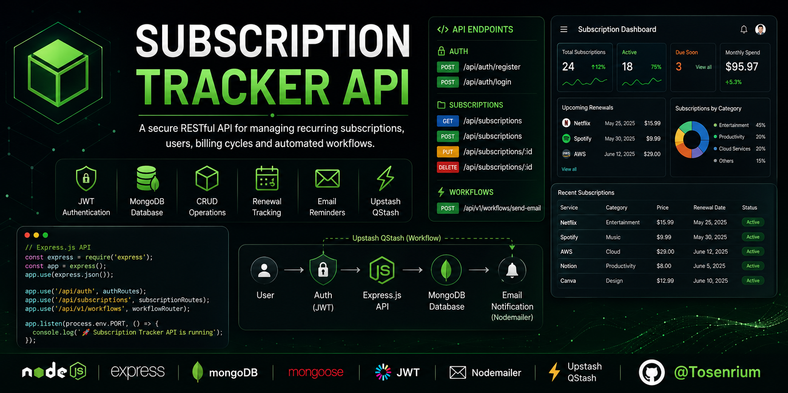

<p align="center">
  
</p>

A production-ready RESTful API built with **Node.js**, **Express.js**, and **MongoDB** for securely managing recurring subscriptions, authentication, billing cycles, and renewal tracking.
A robust RESTful API for managing recurring subscriptions, helping users track billing cycles, monitor upcoming renewals, and stay on top of recurring expenses.

## 🚀 Features

* User authentication and authorization
* Create, read, update, and delete (CRUD) subscriptions
* Track recurring payments and renewal dates
* Categorize subscriptions (e.g., Entertainment, Utilities, Productivity)
* Monitor subscription status (Active, Cancelled, Expired)
* Secure API endpoints with authentication
* RESTful architecture and best practices

## 🛠️ Tech Stack

* Node.js
* Express.js
* MongoDB
* Mongoose
* JWT Authentication
* REST API
* Git & GitHub

## 📁 Project Structure

```text
subscription-tracker-api/
├── controllers/
├── models/
├── routes/
├── middleware/
├── config/
├── utils/
├── .env
├── server.js
└── package.json
```

## ⚙️ Getting Started

### Clone the repository

```bash
git clone git@github.com:Tosenrium/subscription-tracker-api.git
```

### Install dependencies

```bash
npm install
```

### Configure environment variables

Create a `.env` file in the project root and add the required environment variables.

### Run the development server

```bash
npm run dev
```

## 📌 API Endpoints

| Method | Endpoint                 | Description                |
| ------ | ------------------------ | -------------------------- |
| POST   | `/api/auth/register`     | Register a new user        |
| POST   | `/api/auth/login`        | Authenticate a user        |
| GET    | `/api/subscriptions`     | Retrieve all subscriptions |
| POST   | `/api/subscriptions`     | Create a new subscription  |
| PUT    | `/api/subscriptions/:id` | Update a subscription      |
| DELETE | `/api/subscriptions/:id` | Delete a subscription      |

> **Note:** Endpoint paths may change as the project evolves.

## 🎯 Learning Objectives

This project demonstrates practical backend development skills, including:

* REST API design
* Authentication and authorization
* Database modeling with MongoDB
* CRUD operations
* Environment variable management
* Error handling
* Secure API development
* Version control with Git

## 🔮 Future Enhancements

* Email reminders before renewal dates
* Payment history tracking
* Dashboard with subscription analytics
* Search, filtering, and sorting
* Subscription budget insights
* Docker support
* Automated API testing
* CI/CD pipeline integration

## 👤 Author

**Oluwatoki Oluwatosin (Tosenrium)**

Backend Developer | Data Scientist | AI Engineer

Building scalable software solutions and real-world data-driven applications.
